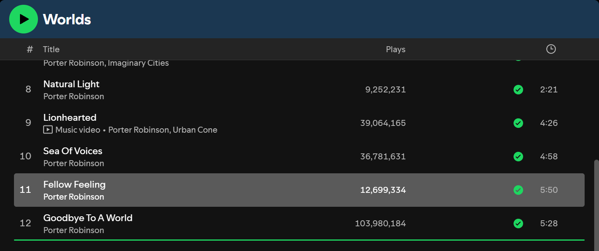

# Album Reorder

Ever had an album where the tracklist just feels wrong? Drag the tracks into the order you want, right on the album page, the same way you'd move songs in a playlist. Spotify then plays the album in your order.



## Usage

- **Reorder:** drag a track on any album page. A green line shows where it will land. Drop it, and the list renumbers itself straight away. You can drag several selected tracks at once.
- **Play:** the album's Play button starts at your first track. Clicking a track, skipping forward and skipping back all follow your order, and Spotify's autoplay picks up after your last track.
- **Reset:** albums with a custom order get a **Reset order** button next to the "…" button. Right-clicking the album also gives you **Reset track order**.


Orders are saved locally in Spotify, per album, and survive restarts.

## Install

**Marketplace:** search for "Album Reorder" in the Spicetify Marketplace and click Install.

**Manually:** copy `albumReorder.js` into your Spicetify `Extensions` folder (`spicetify path userdata` shows where it is), then run:

```
spicetify config extensions albumReorder.js
spicetify apply
```

## Good to know

- Works on albums of any length, including multi-disc albums. On multi-disc albums, the disc split is removed while a custom order is active, and tracks are numbered 1 to N. Reset brings the discs back.
- With shuffle on, Spotify's shuffle wins.
- If an album is already loaded and paused, its Play button resumes it. That's normal Spotify behaviour.

## Compatibility

Tested on Spotify 1.3.3 with Spicetify 2.45. It uses Spotify's internal player and page code, which changes between versions, so each of those pieces has a fallback:

| Part | Preferred | Fallback |
| --- | --- | --- |
| Track list | Spotify's GraphQL API | Spotify Web API |
| Queue | Player queue client | Player queue endpoint (older builds) |
| Updating the page after a drop | In place, keeping your scroll position | Reloads the album page and restores the scroll position |
| Finding the tracklist and action bar | Current Spotify layout | Older layouts |
| Notifications | Spicetify's | Its own toast |

Only Spotify 1.3.3 has actually been tested. On other versions, the worst case should be that reordering stops working while Spotify itself carries on normally. If something breaks on your version, please open an issue.

## How it works

- **Album page:** every request that lists an album's tracks (the page and its later chunks) is served in your order, so Spotify draws the page natively.
- **Playback:** the album starts at your first track. Spotify's "Next up" queue is kept in your order, up to 60 tracks at a time for long albums, and Spotify's autoplay picks up after your last track.
